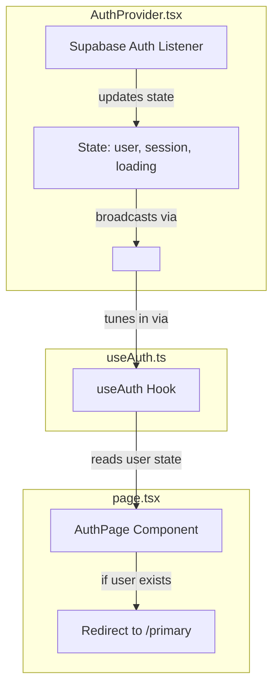

React Context and the `useContext` hook can seem intimidating at first, but they are actually very elegant once you understand the problem they solve.

Below is a detailed, beginner-friendly guide that explains the concept from scratch and shows how it is applied in your three files:

1. [AuthProvider.tsx](frontend/src/context/auth/AuthProvider.tsx) (The "Broadcaster")
2. [useAuth.ts](frontend/src/context/auth/useAuth.ts) (The "Antenna")
3. [page.tsx](frontend/src/app/authpage/page.tsx) (The "Radio Listener")

---

# Part 1: The Problem React Context Solves (Prop Drilling)

In standard React, data is passed down from parent to child components via **Props**.

Imagine a nested tree of components:

```
      [App] (has "user" data)
        │
    [Layout]
        │
   [Dashboard]
        │
  [SidebarMenu]
        │
[UserProfileCard] (needs "user" data)
```

To get the `user` data from `[App]` to `[UserProfileCard]`, you have to pass it through `[Layout]`, `[Dashboard]`, and `[SidebarMenu]` even though **none of those middle components care about the user data**. They only receive it to pass it down.

This annoying and messy process is called **Prop Drilling**.

### The Solution: React Context

React Context acts like a **radio broadcast tower**.

- One component at the top (the **Provider**) broadcasts a signal (the data).
- Any component deeper down in the tree can tune in (using **`useContext`**) and listen to that signal directly, skipping all the middle components!

---

# Part 2: How React Context Works (3 Steps)

Every React Context system consists of three parts:

1. **Create the Context**: Define the shape of the data and initialize the broadcast station.
2. **Provide the Context**: Wrap your application (or a part of it) in a "Provider" component so the signal is available to its children.
3. **Consume the Context**: Use the `useContext` hook in any child component to listen to the signal.

Let's look at how this is implemented in your codebase step-by-step.

---

# Part 3: Deep Dive Into Your Files

## Step 1: The Broadcast Tower — [AuthProvider.tsx](frontend/src/context/auth/AuthProvider.tsx)

This file sets up the **Context** and the **Provider**. Let's break it down line-by-line:

```typescript
"use client"; // 1. Tells Next.js this file contains client-side React code (state, hooks, etc.)

import { createContext, useEffect, useState, type ReactNode } from "react";
import { User, Session } from "@supabase/supabase-js";
import { supabase } from "@/lib/supabaseClient";
```

### 1. The Interface (`AuthContextType`)

Before building our context, we tell TypeScript exactly what kind of information will be broadcasted:

```typescript
interface AuthContextType {
  user: User | null; // The currently logged-in user object (or null if logged out)
  session: Session | null; // The session token/meta from Supabase
  loading: boolean; // A boolean to know if we are still checking the login status
  signOut: () => Promise<void>; // A function that components can call to sign out
}
```

### 2. Creating the Context (`createContext`)

```typescript
export const AuthContext = createContext<AuthContextType | undefined>(
  undefined,
);
```

We use React's `createContext` function to create `AuthContext`. We initialize it with `undefined` because when React first starts up, no provider has mounted yet to give it a real value.

### 3. The Provider Component (`AuthProvider`)

```typescript
export function AuthProvider({ children }: { children: ReactNode }) {
  // We manage the actual state here:
  const [user, setUser] = useState<User | null>(null);
  const [session, setSession] = useState<Session | null>(null);
  const [loading, setLoading] = useState(true);
```

`children` represents any React components that will sit inside our provider (like your whole website or dashboard).

#### The `useEffect` Hook (Supabase listener)

```typescript
useEffect(() => {
  // 1. Fetch initial session from Supabase on load
  supabase.auth
    .getSession()
    .then(({ data: { session } }) => {
      setSession(session);
      setUser(session?.user ?? null);
      setLoading(false);
    })
    .catch((err) => {
      console.error("Failed to get Supabase session:", err);
      setLoading(false);
    });

  // 2. Listen to real-time auth changes (e.g. login, logout, password change)
  const {
    data: { subscription },
  } = supabase.auth.onAuthStateChange((_event, session) => {
    setSession(session);
    setUser(session?.user ?? null);
    setLoading(false);
  });

  // Clean up the listener when the provider is unmounted
  return () => {
    subscription.unsubscribe();
  };
}, []);
```

When this component first loads, it asks Supabase: _"Is there an active session saved in the browser?"_ It updates the state, and also starts a "listener" to detect if the user logs in or logs out in the future.

#### The Sign Out Function

```typescript
const signOut = async () => {
  setLoading(true);
  try {
    await supabase.auth.signOut();
  } catch (err) {
    console.error("Error signing out from Supabase:", err);
  }
  setUser(null);
  setSession(null);
  setLoading(false);
};
```

By placing `signOut` in the provider, any component in the app can trigger it without needing to know Supabase details.

#### Broadcasting the Value

```typescript
  return (
    <AuthContext value={{ user, session, loading, signOut }}>
      {children}
    </AuthContext>
  );
}
```

> [!NOTE]
> In React 19, you can write `<AuthContext value={...}>` directly instead of `<AuthContext.Provider value={...}>`. Your code is using this modern React 19 syntax!
> Any component wrapped inside `<AuthProvider>` (the `children`) will be able to tune into this context value.

---

## Step 2: The Tuning Antenna — [useAuth.ts](frontend/src/context/auth/useAuth.ts)

Instead of forcing components to write `useContext(AuthContext)` directly and do safety checks every single time, we create a **Custom Hook** to make things simpler and safer.

Here is the entire file:

```typescript
"use client";

import { useContext } from "react";
import { AuthContext } from "./AuthProvider";

export function useAuth() {
  const context = useContext(AuthContext); // Tune into the AuthContext radio frequency

  // Safety check:
  if (context === undefined) {
    throw new Error("useAuth must be used within an AuthProvider");
  }

  return context; // Returns { user, session, loading, signOut }
}
```

### Why do we check `if (context === undefined)`?

If you try to use `useAuth()` in a component that is **not** inside the `<AuthProvider>` tags in your React tree, `useContext(AuthContext)` will return `undefined`.
Throwing a clear error immediately helps you debug, telling you: _"Oops! You forgot to wrap your page/layout in the `<AuthProvider>` component."_

---

## Step 3: The Listener — [page.tsx](frontend/src/app/authpage/page.tsx)

Now we want to use the broadcasted information in our login screen.

Let's look at how [page.tsx](frontend/src/app/authpage/page.tsx) consumes this hook:

```typescript
import { useAuth } from "@/context/auth/useAuth"; // 1. Import our custom hook
```

Inside the `AuthPage` component:

```typescript
export default function AuthPage() {
  // ... other state for inputs, loading, errors ...

  const { user } = useAuth(); // 2. Call the hook to get the "user" object from context!
  const router = useRouter();

  // If already logged in, redirect to the dashboard ("/primary")
  useEffect(() => {
    if (user) {
      router.replace("/primary");
    }
  }, [user, router]);

  // If user is logged in, don't show the login form at all
  if (user) {
    return null;
  }

  // ... rest of the login form code ...
}
```

### How does this connection work?

1. The component calls `useAuth()`.
2. React goes up the component tree to find the nearest `<AuthContext>` (provided by `AuthProvider`).
3. It grabs the current state (`user`) from that provider.
4. When `user` changes (e.g., when the operator logs in successfully), the `AuthProvider` state changes, which updates the context.
5. React automatically detects this update and **re-renders** `AuthPage`.
6. The `useEffect` inside `AuthPage` triggers because `user` is now defined, redirecting the user to `/primary`!

---

# Summary of the Flow

Here is a visual summary of how authentication state flows in your app:



### Key takeaways:

- **`createContext`** sets up the data contract and broadcast channel.
- **`AuthProvider`** sits near the root of the app, manages the state, and broadcasts updates down the tree.
- **`useContext`** (wrapped in `useAuth`) lets any child component tune in to the broadcast to read the state and use functions like `signOut` without passing props through intermediate files.
